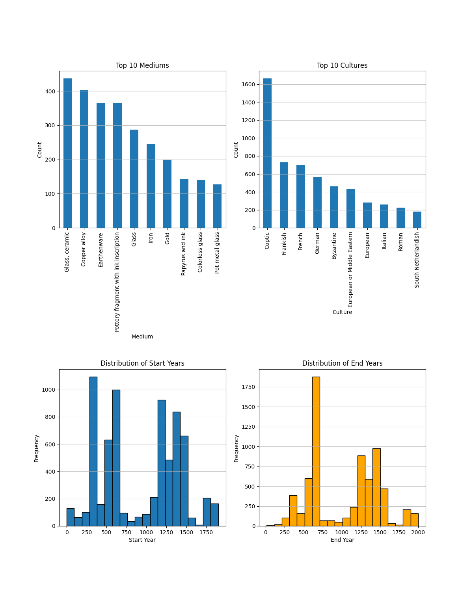
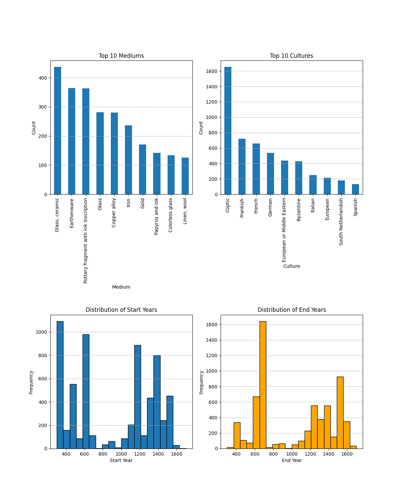

# Medieval Art Data Analysis

This small data analysis project explores the Metropolitan Museum of Art's collection of medieval art. It involves data cleaning, visualization, and some basic analysis to gain insights into the collection. Below is an overview of the project's components:

## Table of Contents

- [Requirements](#requirements)
- [Data Retrieval](#data-retrieval)
- [Data Cleaning](#data-cleaning)
- [Data Visualization](#data-visualization)
- [Analysis](#analysis)

### Requirements

- Python 3.10
- Pandas
- Matplotlib
- NumPy
- Requests

### Data Retrieval

The project begins with the retrieval of data from a CSV file named "met.csv." downloaded from the Met. 

### Data Cleaning

The data is cleaned to prepare it for analysis. This includes:

- Filtering the dataset to include only the "Medieval Art" department.
- Converting the "Object Begin Date" column to numeric values.
- Selecting relevant columns, including "Object Number," "Title," "Object Date," "Culture," and "Medium."
- Removing rows with missing values in the "Object Date" column.
- Parsing date ranges and normalizing year values.

### Data Visualization

The project uses Matplotlib to create visualizations that provide insights into the data:

- Histograms of the distribution of start and end years of the art objects.
- Bar charts showing the top 10 most frequent mediums and cultures in the collection.

### Analysis

Basic analysis is performed on the dataset:

- Displaying the first 5 rows of the cleaned dataset.
- Listing the unique values in the "Medium" and "Culture" columns.
- Identifying the top 10 most frequent cultures and mediums present in the collection.

This project provides a starting point for exploring the Metropolitan Museum of Art's medieval art collection, enabling further research and analysis based on the cleaned and visualized data.

